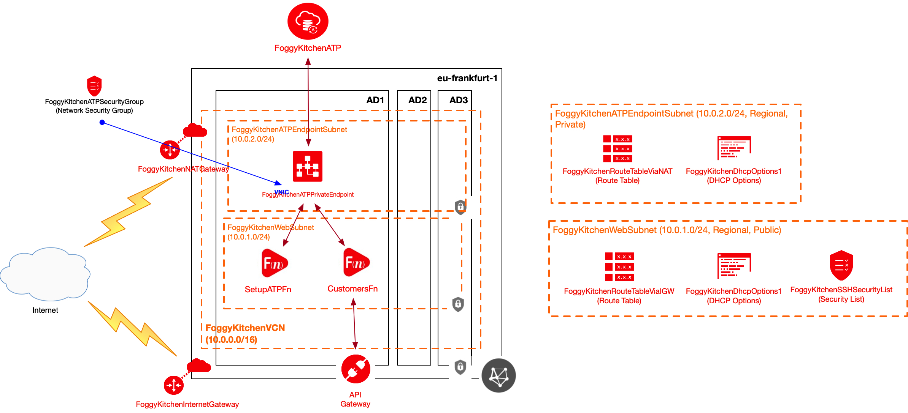
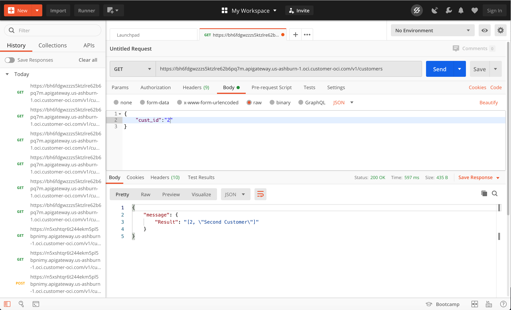

# Terraform OCI Microservice

## Project description

In this repository I have documented my hands-on experience with Terrafrom for the purpose of OCI Microservice deployment. This set of HCL based Terraform files can customized according to any requirements.  

## Topology Diagram 

With the usage of this example HCL code you can build topology documented by diagram below. This topology is extremly simplified for education purposes and rather cannot be used for production implementations. For accessing ATP I am using two functions (first function SetupATPFn for creating app user and customer table, second one CustomersFn for giving full Query/DML capability for Customers table nested in ATP instance). Ultimately CustomerFn function is exposed to external world via OCI API Gateway. 



## How to use code 

### STEP 1.

Clone the repo from GitHub by executing the command as follows and then go to terraform-oci-microservice directory:

```
[opc@terraform-server ~]$ git clone https://github.com/mlinxfeld/terraform-oci-microservice.git
Cloning into 'terraform-oci-microservice'...
remote: Enumerating objects: 45, done.
remote: Counting objects: 100% (45/45), done.
remote: Compressing objects: 100% (31/31), done.
remote: Total 45 (delta 19), reused 40 (delta 14), pack-reused 0
Unpacking objects: 100% (45/45), done.

[opc@terraform-server ~]$ cd terraform-oci-microservice/

[opc@terraform-server terraform-oci-microservice]$ ls -latr
total 1044
-rw-r--r--   1 opc opc     238 26 maj 13:54 provider.tf
-rw-r--r--   1 opc opc     219 27 maj 10:42 internet_gateway.tf
-rw-r--r--   1 opc opc     204 27 maj 10:42 natgateway.tf
-rw-r--r--   1 opc opc     400 27 maj 10:42 route1.tf
-rw-r--r--   1 opc opc     391 27 maj 10:42 route2.tf
-rw-r--r--   1 opc opc     401 27 maj 10:42 subnet_atp_endpoint.tf
-rw-r--r--   1 opc opc     193 27 maj 10:42 vcn.tf
-rw-r--r--   1 opc opc     411 27 maj 10:42 dhcp_options.tf
drwxr-xr-x   4 opc opc     128 28 maj 14:00 functions
drwxr-xr-x  45 opc opc    1440 28 maj 14:33 ..
-rw-r--r--   1 opc opc    2351 28 maj 14:57 variables.tf
-rw-r--r--   1 opc opc     659 28 maj 14:59 atp_wallet.tf
-rw-r--r--   1 opc opc     147 29 maj 14:02 sqlnet.ora
-rw-r--r--   1 opc opc    2963 31 maj 18:52 fn_setup.tf
-rw-r--r--   1 opc opc    1278 31 maj 21:19 functions.tf
-rw-r--r--   1 opc opc     226  2 cze 09:09 security_group.tf
-rw-r--r--   1 opc opc     460  2 cze 09:12 subnet_web.tf
-rw-r--r--   1 opc opc     682  2 cze 09:12 security_list.tf
-rw-r--r--   1 opc opc     796  2 cze 09:12 security_group_rule.tf
-rw-r--r--   1 opc opc    1052  2 cze 09:52 api_gateway.tf
-rw-r--r--@  1 opc opc  802004  2 cze 11:01 postman_test.jpg
-rw-r--r--   1 opc opc    1125  2 cze 11:02 atp.tf
drwxr-xr-x  28 opc opc     896  2 cze 11:03 .
-rw-r--r--@  1 opc opc    8330  2 cze 11:07 README.md

```

### STEP 2.

Within web browser go to URL: https://www.terraform.io/downloads.html. Find your platform and download the latest version of your terraform runtime. Add directory of terraform binary into PATH and check terraform version:

```
[opc@terraform-server terraform-oci-microservice]$ export PATH=$PATH:/home/opc/terraform

[opc@terraform-server terraform-oci-microservice]$ terraform --version

Terraform v0.12.16

Your version of Terraform is out of date! The latest version
is 0.12.17. You can update by downloading from https://www.terraform.io/downloads.html
```

### STEP 3. 
Next create environment file with TF_VARs:

```
[opc@terraform-server terraform-oci-microservice]$ vi setup_oci_tf_vars.sh
export TF_VAR_user_ocid="ocid1.user.oc1..aaaaaaaaob4qbf2(...)uunizjie4his4vgh3jx5jxa"
export TF_VAR_tenancy_ocid="ocid1.tenancy.oc1..aaaaaaaas(...)krj2s3gdbz7d2heqzzxn7pe64ksbia"
export TF_VAR_compartment_ocid="ocid1.compartment.oc1..aaaaaaaacnmuyhg2mpb3z(...)nai3jk5qaoieg3ztinqhamalealq"
export TF_VAR_fingerprint="00:f9:d1:41:bb:57(...)82:47:e6:00"
export TF_VAR_private_key_path="/tmp/oci_api_key.pem"
export TF_VAR_region="eu-frankfurt-1"
export TF_VAR_atp_admin_password="BEstrO0ng_#11"
export TF_VAR_ocir_repo_name="functions"
export TF_VAR_ocir_user_name="martin.linxfeld@foggykitchen.com"
export TF_VAR_ocir_namespace="foggykitchen"
export TF_VAR_ocir_docker_repository="fra.ocir.io"
export TF_VAR_ocir_user_password="HsX]Ea(...):z4dgj2"

[opc@terraform-server terraform-microservice]$ source setup_oci_tf_vars.sh
```

### STEP 4.
Run *terraform init* with upgrade option just to download the lastest neccesary providers:

```
[opc@terraform-server terraform-oci-microservice]$ terraform init -upgrade

Initializing the backend...

Initializing provider plugins...
- Checking for available provider plugins...
- Downloading plugin for provider "null" (hashicorp/null) 2.1.2...
- Downloading plugin for provider "random" (hashicorp/random) 2.2.1...
- Downloading plugin for provider "local" (hashicorp/local) 1.4.0...
- Downloading plugin for provider "oci" (hashicorp/oci) 3.64.0...

The following providers do not have any version constraints in configuration,
so the latest version was installed.

To prevent automatic upgrades to new major versions that may contain breaking
changes, it is recommended to add version = "..." constraints to the
corresponding provider blocks in configuration, with the constraint strings
suggested below.

* provider.local: version = "~> 1.4"
* provider.null: version = "~> 2.1"
* provider.random: version = "~> 2.2"

Terraform has been successfully initialized!

You may now begin working with Terraform. Try running "terraform plan" to see
any changes that are required for your infrastructure. All Terraform commands
should now work.

If you ever set or change modules or backend configuration for Terraform,
rerun this command to reinitialize your working directory. If you forget, other
commands will detect it and remind you to do so if necessary.
```

### STEP 5.
Run *terraform apply* to provision the content of this code (type **yes** to confirm the the apply phase):

```
[opc@terraform-server terraform-oci-microservice]$ terraform apply 

An execution plan has been generated and is shown below.
Resource actions are indicated with the following symbols:
  + create
 <= read (data resources)

Terraform will perform the following actions:

  # data.oci_core_vnic.FoggyKitchenWebserver1_VNIC1 will be read during apply

(...)

Plan: 23 to add, 0 to change, 0 to destroy.

Do you want to perform these actions?
  Terraform will perform the actions described above.
  Only 'yes' will be accepted to approve.


(...)

Apply complete! Resources: 23 added, 0 changed, 0 destroyed.

Outputs:

FoggyKitchenAPIGatewayDeployment_EndPoint = [
  "https://bh6fdgwzzzs5ktzlre62b6pq7m.apigateway.us-ashburn-1.oci.customer-oci.com/v1",
]

(...)

```

### STEP 6.
Confirm that CustomerFn is responding via API Gateway: 


#### USE CASE 1. SELECT ####

Passing cust_id with the usage of GET method will result with the record which fits the criteria:

```
[opc@terraform-server terraform-oci-microservice]$ curl -k -X GET https://bh6fdgwzzzs5ktzlre62b6pq7m.apigateway.us-ashburn-1.oci.customer-oci.com/v1/customers -d '{"cust_id":"2"}'

{"message": {"Result": "[2, \"Second Customer\"]"}}
```

If we want to select all of the records from the table we need to remove cust_id section:

```
[opc@terraform-server terraform-oci-microservice]$ curl -k -X GET https://bh6fdgwzzzs5ktzlre62b6pq7m.apigateway.us-ashburn-1.oci.customer-oci.com/v1/customers

{"message": {"Result": "[[1, \"First Customer\"], [2, \"Second Customer\"], [3, \"Third Customer\"]]"}}

```
#### USE CASE 2. INSERT ####

Besides of GET which is for SELECT statements we can also add records by POST method:

```
[opc@terraform-server terraform-oci-microservice]$ curl -k -X POST https://bh6fdgwzzzs5ktzlre62b6pq7m.apigateway.us-ashburn-1.oci.customer-oci.com/v1/customers -d '{"cust_name":"Fourth Customer"}'

{"message": {"Result": "Row inserted (cust_id=4, cust_name=Fourth Customer)"}}

```

#### USE CASE 3. UPDATE ####

We can update record by PUT method:

```
[opc@terraform-server terraform-oci-microservice]$ curl -k -X PUT https://bh6fdgwzzzs5ktzlre62b6pq7m.apigateway.us-ashburn-1.oci.customer-oci.com/v1/customers -d '{"cust_id":"4", "cust_name":"Fourth Customer UPDATED"}'

{"message": {"Result": "Row updated (cust_id=4, cust_name=Fourth Customer UPDATED)"}}

```

#### USE CASE 4. DELETE ####

We can update record by PUT method:

```
[opc@terraform-server terraform-oci-microservice]$ curl -k -X DELETE https://bh6fdgwzzzs5ktzlre62b6pq7m.apigateway.us-ashburn-1.oci.customer-oci.com/v1/customers -d '{"cust_id":"4"}'

{"message": {"Result": "Row deleted (cust_id=4)"}}

```

Alternative approach is to use Postman GUI as follows:




### STEP 7.
After testing the environment you can remove the whole OCI infra. You should just run *terraform destroy* (type **yes** for confirmation of the destroy phase):

```
[opc@terraform-server terraform-oci-microservice]$ terraform destroy

oci_identity_compartment.FoggyKitchenCompartment: Refreshing state... [id=ocid1.compartment.oc1..aaaaaaaagillnk7ttj6wpdhmewpibpxc5gbmrfxdtmaa3gfgjzbudesm3tsq]
oci_core_virtual_network.FoggyKitchenVCN: Refreshing state... [id=ocid1.vcn.oc1.eu-frankfurt-1.amaaaaaadngk4gialu6ikx45brprlpzi2oyibbsl6slts36bar4vgcjlmgjq]
(...)

Plan: 0 to add, 0 to change, 23 to destroy.

Do you really want to destroy all resources?
  Terraform will destroy all your managed infrastructure, as shown above.
  There is no undo. Only 'yes' will be accepted to confirm.

  Enter a value: yes

(...)

oci_core_network_security_group.FoggyKitchenWebSecurityGroup: Destruction complete after 5s
oci_core_virtual_network.FoggyKitchenVCN: Destroying... [id=ocid1.vcn.oc1.iad.amaaaaaac3adhhqat3gn63eiilexiwzgyrjoi6few7dcf36ilddupukf6mpa]
oci_core_virtual_network.FoggyKitchenVCN: Destruction complete after 1s
oci_identity_compartment.FoggyKitchenCompartment: Destroying... [id=ocid1.compartment.oc1..aaaaaaaarrlkyjshc4i7gqr56sydav2lpcdhhqwy2b72mj6iruy3r4z3j7ra]
oci_identity_compartment.FoggyKitchenCompartment: Destruction complete after 0s

Destroy complete! Resources: 23 destroyed.
```
